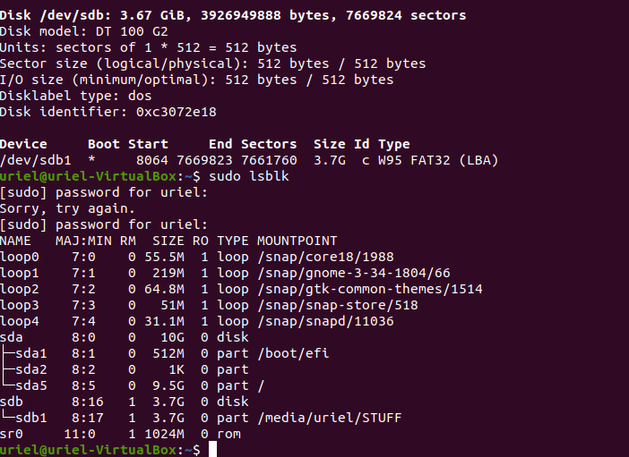
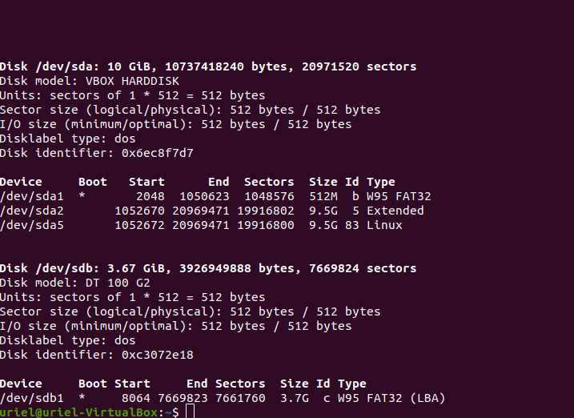

# Connect a USB and show partitions

1. Conectar la USB a la maquina y mostrar la informacion.

```
sudo lsblk
```



2. Con el comando **sudo fdisk -l** mostramos su tabla de particiones.

```
sudo fdisk -l
```



