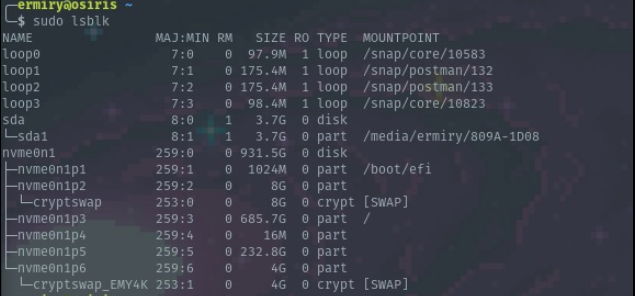
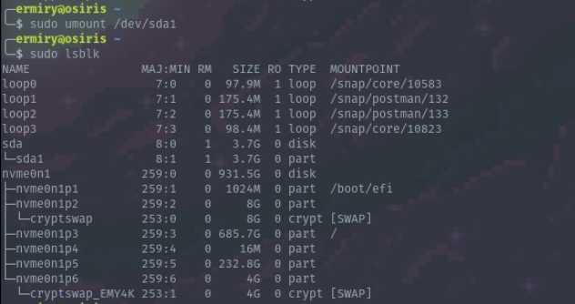
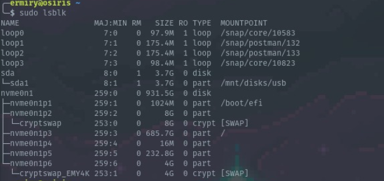
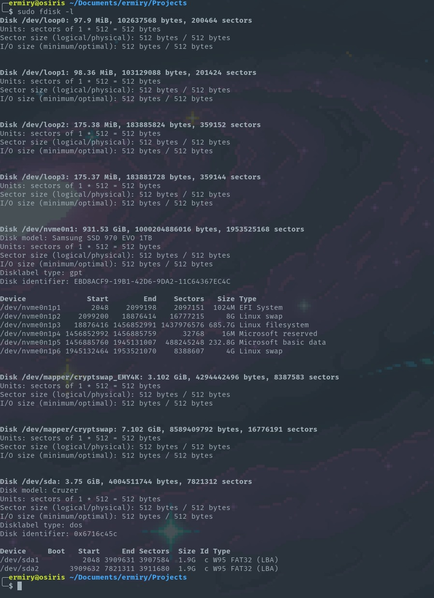
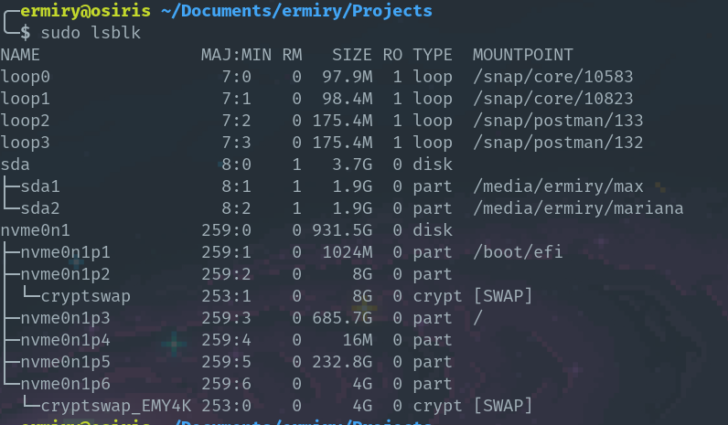
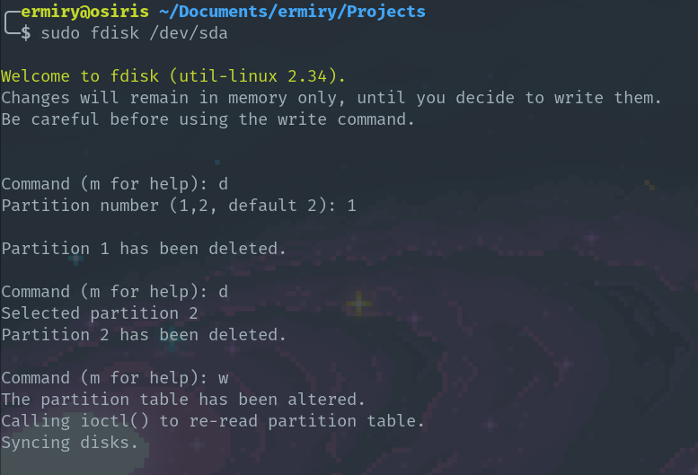
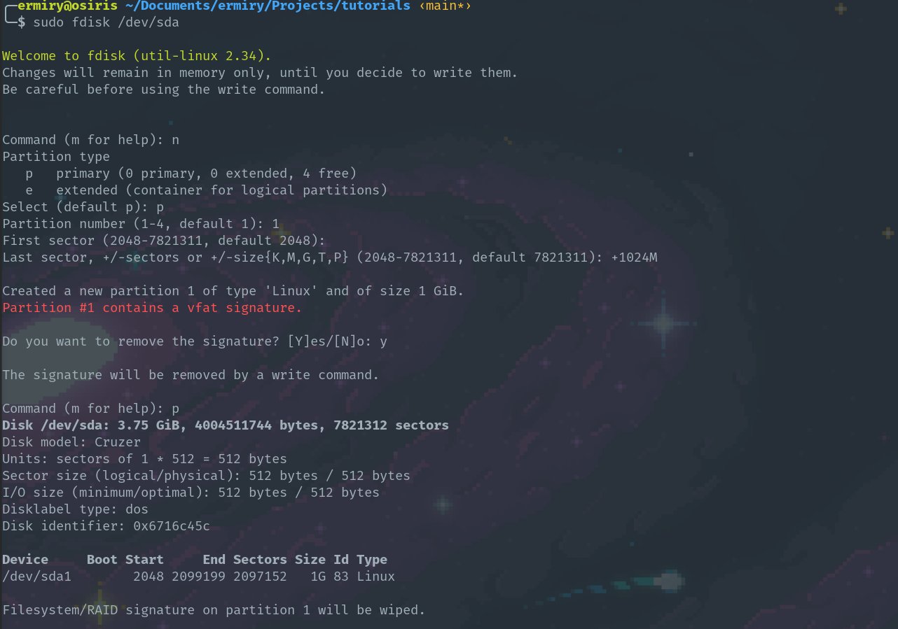
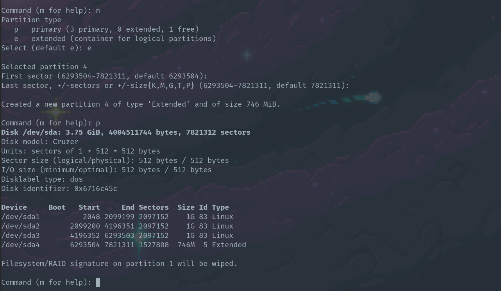
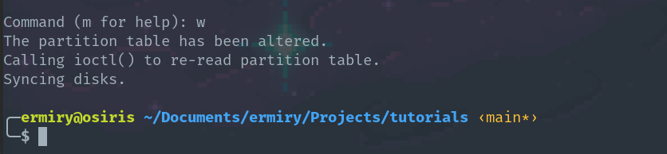

# 1.- Differences between sda, hda and vda
### sda and hda
1. sdx es el primer disco de tipo IDE/SATA/SCSI.
2. hdx es un disco fisico emulado.  
Cuando el kernel o algun programa accesan a estos se pueden realizar diferentes cosas especificas de discos fisicos.
### vda
1. vdx es para discos virtuales. Lo que el kernel hace cuando accesa es decirle al software de visualizacion que la informacion se necesita leer o escribir.  
En general, vdx es mas rapido dado que el kernel no tiene que decirle al disco que hacer, solo debe comunicarse con el **hypervisor** de la VM.

----------------------------------------------------------------------------------------------------------------------------------------------------------------------------------------------------------------------

# 2.- Mount and Unmount usb from command line

1. Primero mostrar los discos actuales
   
```
sudo lsblk
```


2. Conectar la usb y volver a mostrar la informacion de los discos

```
sudo lsblk
```



3. Sabemos que la usb esta montada como el disco **sda** en el path **/media/ermiry/809A-1D08**. Para desmontar la usb corremos el siguiente comando

```
sudo umount /dev/sda1
```



4. Volver a mostrar los discos para comprobar que la usb ya no esta montada

```
sudo lsblk
```

5. Crear una nueva carpeta donde se montara la usb nuevamente

```
sudo mkdir /mnt/disks
sudo mkdir /mnt/disks/usb
```

6. Montar la usb en el nuevo path **/mnt/disks/usb**

```
sudo mount /dev/sda1 /mnt/disks/usb
```



7. Ya se puede accesar la informacion de la usb en el path **/mnt/disks/usb**

```
cd /mnt/disks/usb
ls 
```

----------------------------------------------------------------------------------------------------------------------------------------------------------------------------------------------------------------------

3

----------------------------------------------------------------------------------------------------------------------------------------------------------------------------------------------------------------------

# 4.- View linux disk partitions table 

 * Se ingresa el comando 
```
sudo fdisk -l
```



----------------------------------------------------------------------------------------------------------------------------------------------------------------------------------------------------------------------

5

----------------------------------------------------------------------------------------------------------------------------------------------------------------------------------------------------------------------

# 6.- Delete all usb partitions

1. Primero mostrar los discos actuales
   
```
sudo lsblk
```

2. Conectar la usb y volver a mostrar la informacion de los discos. Sabemos que la usb esta montada como el disco **sda** y tiene dos particiones:

- **sda1** montada en **/media/ermiry/max**
- **sda2** montada en **/media/ermiry/mariana**

```
sudo lsblk
```



3. Para desmontar la usb corremos los siguientes comandos

```
sudo umount /dev/sda1
sudo umount /dev/sda2
```

4. Utilizamos el siguiente comando para poder hacer modificaciones a las particiones de la usb

```
sudo fdisk /dev/sda
```

5. Dentro de la consola de **fdisk** metemos el comando **d** para borar las 2 particiones. Una vez que estemos seguros de los cambios se usa el comando **w** para es escribirlos definitivamente



----------------------------------------------------------------------------------------------------------------------------------------------------------------------------------------------------------------------

# 7.- Create partitions inside usb

1. Primero mostrar los discos actuales
   
```
sudo lsblk
```

2. Conectar la usb y volver a mostrar la informacion de los discos para identificar cual es el disco que vamos a modificar

```
sudo lsblk
```

4. Desmontamos la usb para poder realizar operaciones en ella

```
sudo umount /dev/sda1
```

5. Utilizamos el comando **fdisk** para crear particiones. Se crearan **3 particiones primarias de 1GB c/u**

- Introducimos el comando **n** y seleccionamos **p** para crear una particion primaria
- Le dejamos el valor del primer sector como default
- Seleccionamos el ultimo sector usando **+1024M** para indicar que la particion tendra un tamano de **1GB**



5.1 Repetimos los pasos anteriores para crear las siguientes dos particiones


6. Creamos una particion extendida en el espacio sobrante

- Introducimos el comando **n** y seleccionamos **e** para crear una particion extendida
- Le dejamos el valor del primer y ultimo sector como default



7. Para finalizar introducimos el comando **w** para que los cambios tengan efecto en el disco



----------------------------------------------------------------------------------------------------------------------------------------------------------------------------------------------------------------------

8

----------------------------------------------------------------------------------------------------------------------------------------------------------------------------------------------------------------------

9

----------------------------------------------------------------------------------------------------------------------------------------------------------------------------------------------------------------------

10

----------------------------------------------------------------------------------------------------------------------------------------------------------------------------------------------------------------------
