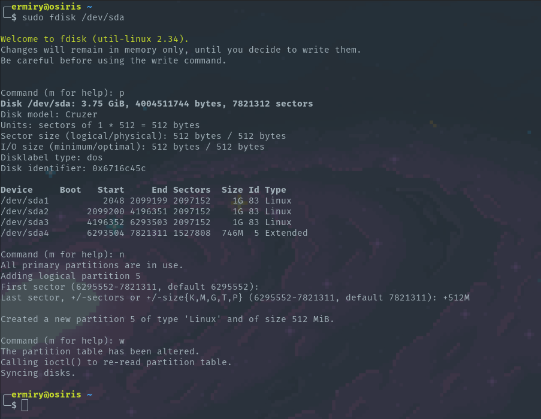
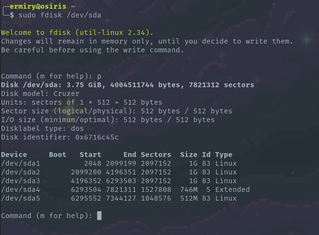

# Create a logical partition inside an extended partition

0. Para poder crear una particion logica en un disco, es necesario contar con una particion extendida. En este ejemplo se muestra una usb con 3 particiones primarias y una extendida

1. Se debe de desmontar la usb para poder realizar operaciones en ella

```
sudo umount /dev/sda1
```

1. Utilizamos el comando **fdisk** para crear la particion logica
- Si no existen 3 particiones primarias, introducimos el comando **l** para seleccionar una particion logica. Si ya existen particones primarias (como en este ejemplo) solo tendremos la opcion de crear una particion logica
- Dejamos el valor de primer sector con el valor default
- Seleccionamos el tamanoop que le queremos dar a la particion, en este caso de 512M
- Introducimos el comando **w** para registrar los cambios en el disco



2. Ahora podemos desplegar las particiones del disco para verificar que tengamos la nueva particion

