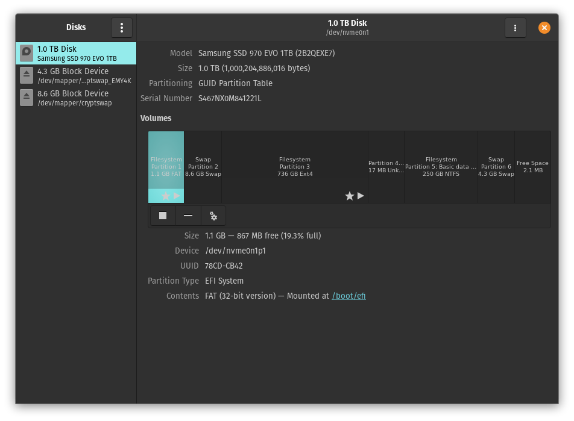
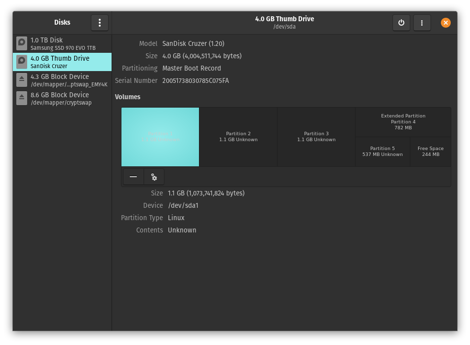
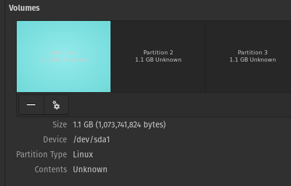
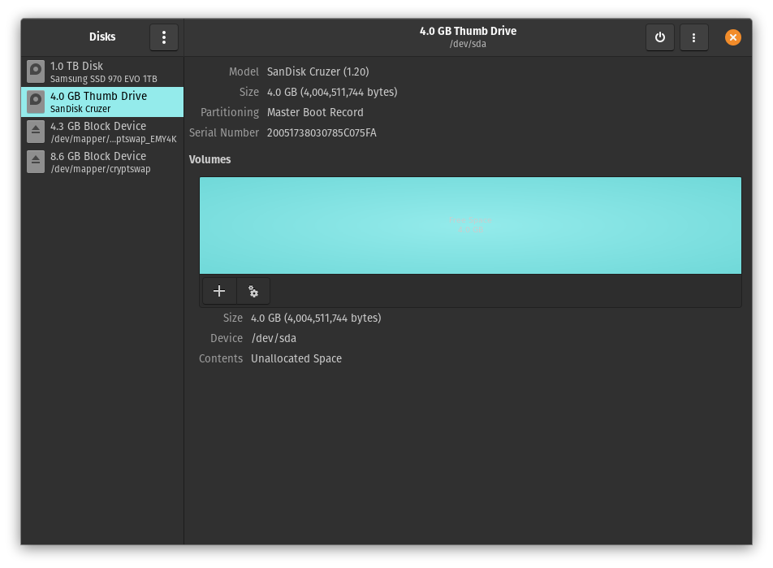
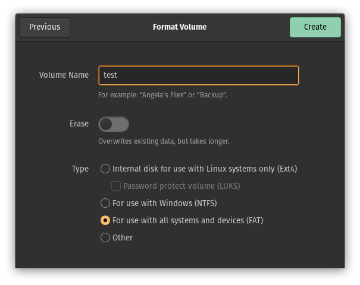

# Use the disks application

1. En ubuntu abrir la aplicacion denominada **disks**. Esta applicaion nos permite ver los dispositivos de almacenamiento que tengamos conectados al igual que las particiones que existen en cada uno de ellos

2. Al insertar la usb, podemos observar que nos aparece un dispositivo nuevo en la barra izquierda; si lo seleccionamos podremos observar las particiones que actuamente tiene

3. Para eliminar una particion del disco, la seleccionamos haciendo click sobre ella, despues seleccionamos el boton de **-** y confirmamos en el dialogo que la queremos borrar

4. Releazamos el paso **3** con las demas particiones que existan en nuestra usb

5. En este punto no debemos de tener ninguna particion en la usb

6. Procedemos a crear una nueva particion que pueda abarcar todo el disco
- Seleccionar el espacio libre del disco y oprimir el boton **+**
- Seleccionamos el tamano completo del disco (en este caso de 4GB)
- Le damos un nombre a nuestra particion y selecionamos que utilice el formato FAT
- Seleccionamos el boton create

7. Terminamos con una particion primaria del tamano completo del disco

