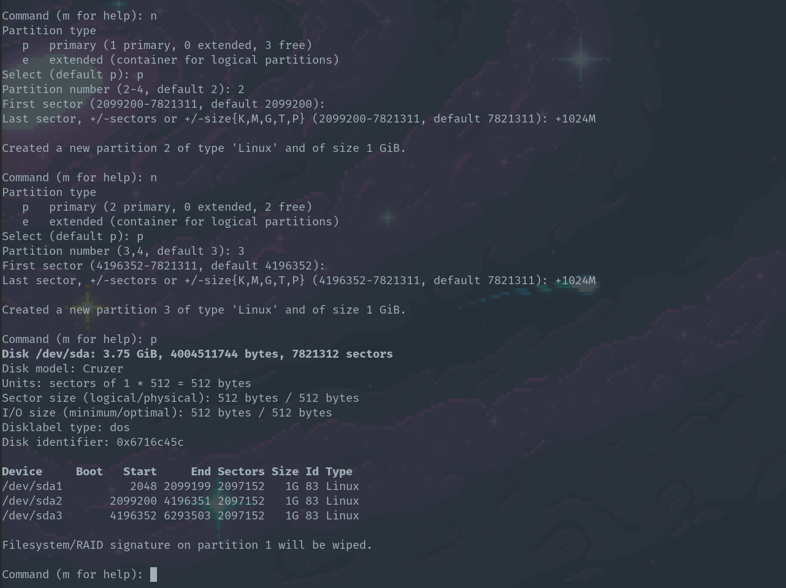
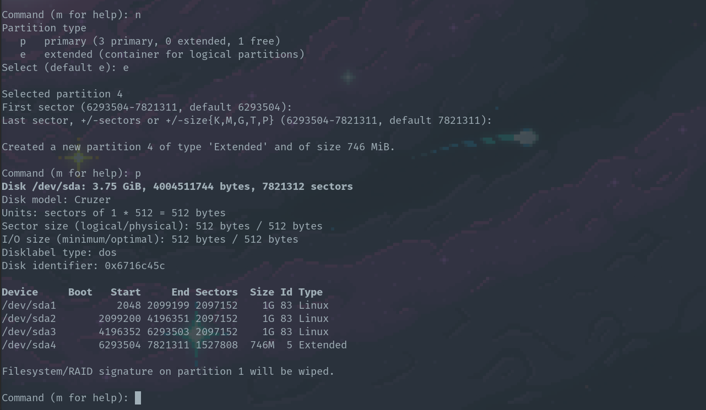
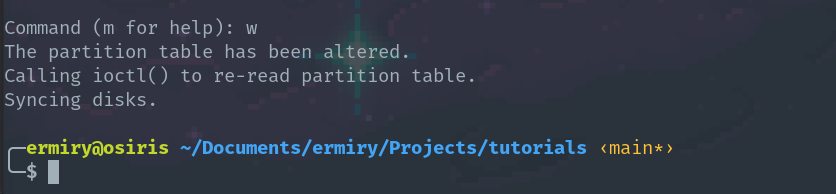

# Create partitions inside usb

1. Primero mostrar los discos actuales
   
```
sudo lsblk
```

2. Conectar la usb y volver a mostrar la informacion de los discos para identificar cual es el disco que vamos a modificar

```
sudo lsblk
```

4. Desmontamos la usb para poder realizar operaciones en ella

```
sudo umount /dev/sda1
```

5. Utilizamos el comando **fdisk** para crear particiones. Se crearan **3 particiones primarias de 1GB c/u**

- Introducimos el comando **n** y seleccionamos **p** para crear una particion primaria
- Le dejamos el valor del primer sector como default
- Seleccionamos el ultimo sector usando **+1024M** para indicar que la particion tendra un tamano de **1GB**


5.1 Repetimos los pasos anteriores para crear las siguientes dos particiones



6. Creamos una particion extendida en el espacio sobrante

- Introducimos el comando **n** y seleccionamos **e** para crear una particion extendida
- Le dejamos el valor del primer y ultimo sector como default



7. Para finalizar introducimos el comando **w** para que los cambios tengan efecto en el disco


