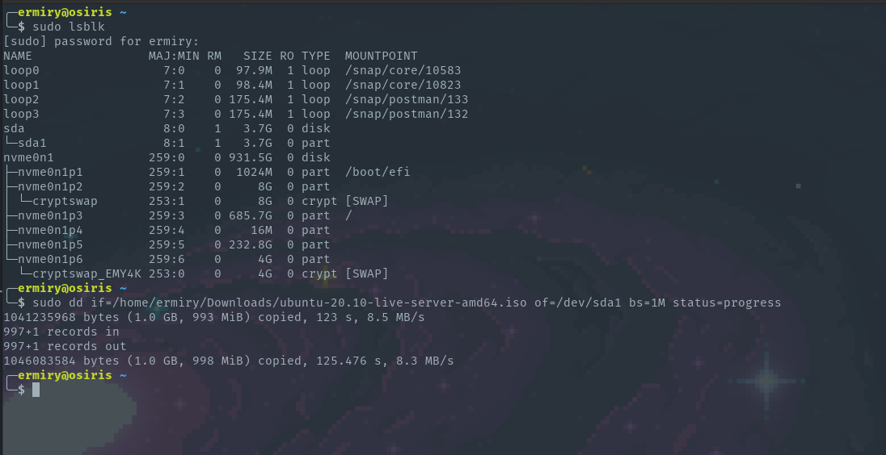

# Create live usb from an .iso image

0. Para poder realizar este tutorial, se debe de contar con una imagen de disco **.iso** de la distribucion de Linux que se desea instalar

1. Primero mostrar los discos actuales
   
```
sudo lsblk
```

2. Conectar la usb y volver a mostrar la informacion de los discos para identificar cual es el disco que vamos a modificar

```
sudo lsblk
```

3. Desmontamos la usb para poder realizar operaciones en ella

```
sudo umount /dev/sda1
```

4. Ahora usaremos el comando **dd** para quemar la imagen en la usb y poder usarla para bootear desde ella

- En el argumento **if** se selecciona la imagen que se quiere usar
- En el argumento **of** se selecciona el disco en formato **/dev/sda1**

```
sudo dd if=[.iso] of=[disk] bs=1M status=progress
```

**Ejemplo**
```
sudo dd if=/home/ermiry/Downloads/ubuntu-20.10-live-server-amd64.iso of=/dev/sda1 bs=1M status=progress
```

