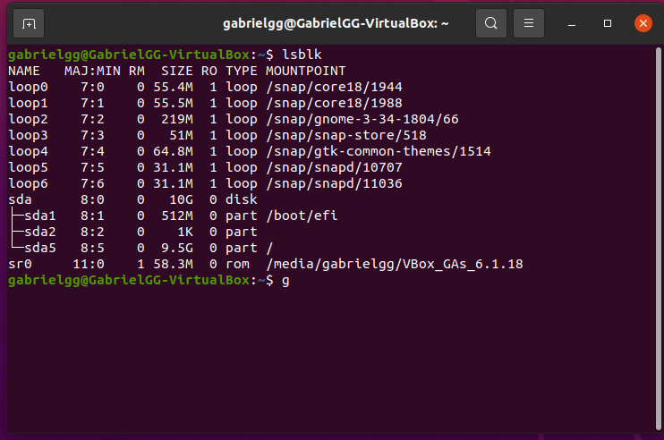
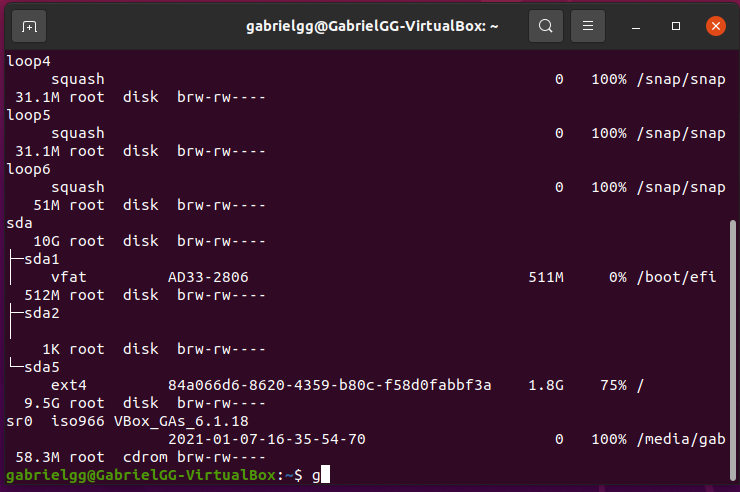

# Show device information

1.- Entramos a la terminal 

2.- En la terminal meter el comando **lsblk**

```
 lsblk
 ```
 

  Con ese comando se visualiza los dispositivos, unidades, particiones y sus capacidades (estén montadas o no las unidades).

  3.- Si al comando se le agrega **-fm** muestra informacion mas detallada de los dispositivos.

  ```
  lsblk -fm
  ```

  