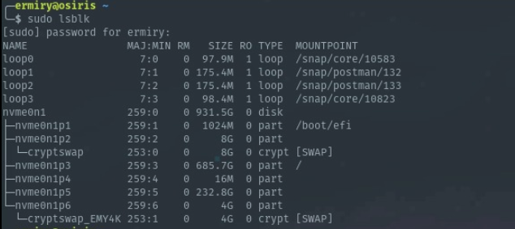

# Mount and Unmount usb from command line

1. Primero mostrar los discos actuales
   
```
sudo lsblk
```



2. Conectar la usb y volver a mostrar la informacion de los discos

```
sudo lsblk
```


3. Sabemos que la usb esta montada como el disco **sda** en el path **/media/ermiry/809A-1D08**. Para desmontar la usb corremos el siguiente comando

```
sudo umount /dev/sda1
```


4. Volver a mostrar los discos para comprobar que la usb ya no esta montada

```
sudo lsblk
```

5. Crear una nueva carpeta donde se montara la usb nuevamente

```
sudo mkdir /mnt/disks
sudo mkdir /mnt/disks/usb
```

6. Montar la usb en el nuevo path **/mnt/disks/usb**

```
sudo mount /dev/sda1 /mnt/disks/usb
```


7. Ya se puede accesar la informacion de la usb en el path **/mnt/disks/usb**

```
cd /mnt/disks/usb
ls 
```